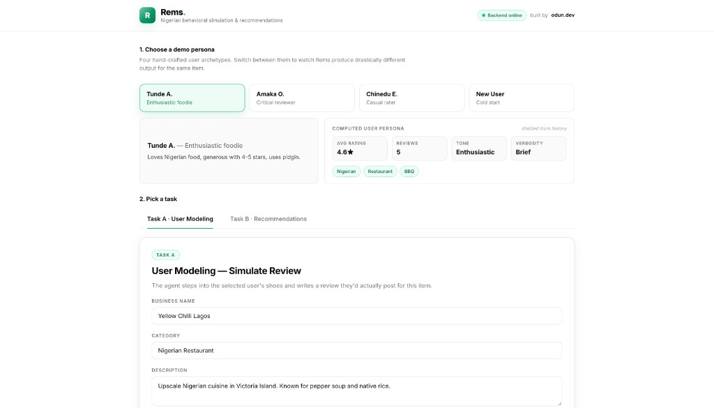
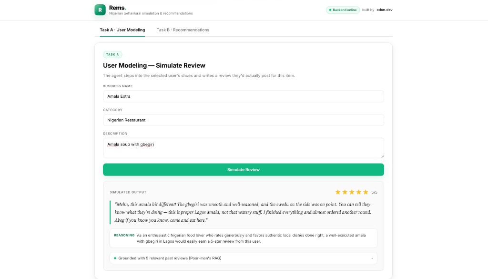
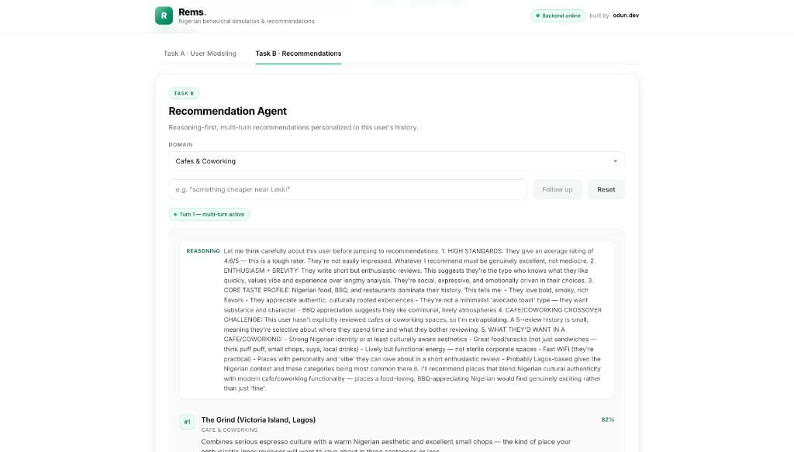

# Rems Review Agent
### Nigerian Behavioural Simulation & Recommendations
**DSN × BCT LLM Agent Challenge — Solution Paper**

**Author:** Emmanuel Olagbemisoye ([odun.dev](https://odunayo-portfolio-eight.vercel.app))
**Submission date:** 24 May 2026
**Repository:** [github.com/datharnu/rems](https://github.com/datharnu/rems)

---

### Abstract

Rems is an LLM-powered agent that simulates Nigerian user reviews (Task A) and delivers personalised, reasoning-first recommendations (Task B). The system uses deterministic persona extraction and category-overlap retrieval to ground Claude Sonnet 4 — **without vector databases or model fine-tuning** — and applies a Nigerian cultural layer at the prompt level. This paper describes the architecture, pilot evaluation, ablations, and limitations.

---

## 1. Introduction

Online review platforms encode preference, tone, and context — yet most AI systems treat users as static profiles. **Rems Review Agent** addresses both competition tasks:

- **Task A — User Modeling:** given a user's review history and an unseen item, simulate the review text and star rating that user would most plausibly produce.
- **Task B — Recommendation:** given a user persona, generate ranked recommendations with explicit agentic reasoning — including cold-start, cross-domain, and multi-turn refinement.

Nigerian contextualisation is a core architectural choice affecting persona extraction, prompt design, and evaluation — not a cosmetic overlay.

---

## 2. Dataset & Data Understanding

### 2.1 Dataset selection

The **Yelp Open Dataset** informed our schema (user → review → business linkage, star ratings, categories, review text). For this submission we ship a **reproducible demo corpus** in the repository:

| Split | Size | Purpose |
| --- | --- | --- |
| Backend sample (`yelp_sample.json`) | 5 users · 14 reviews · 5 businesses | API / Docker demo |
| UI personas (frontend) | 4 archetypes · 16 reviews total | Judge-facing behavioural diversity |

The full Yelp dump is not bundled — it makes instant Docker reproduction harder for judges. Ingestion of 500+ held-out Yelp users for quantitative metrics is scoped to future work (§9).

### 2.2 Persona signals extracted

| Signal | Description | Use |
| --- | --- | --- |
| Average star rating | Mean of historical ratings | Anchors rating simulation |
| Rating distribution | Spread of 1–5 stars | Detects lenient vs harsh raters |
| Review verbosity | Avg word count per review | Controls output length |
| Tone classification | Keyword-based heuristic | Shapes review voice |
| Category preferences | Top reviewed business types | Drives retrieval & recommendations |
| Cold-start flag | True when history is empty | Triggers baseline behaviour |

### 2.3 Nigerian contextualisation

Nigerian consumer behaviour is modelled at the **prompt and persona layer**: direct expressive tone, community/price signals, food authenticity markers (*"correct"*, *"on point"*), and slightly conservative rating psychology relative to US equivalents.

---

## 3. System Architecture

### 3.1 Overview

Rems is a containerised Node.js application with two pipeline-sharing agents. **Architectural constraint:** the system deliberately avoids vector databases and model fine-tuning. Instead, deterministic persona extraction plus category-overlap retrieval ground Claude — trading embedding infrastructure for reproducibility, explainability, and a one-command Docker demo.

```
Client (React UI, nginx)
       │  POST /api/*
Express.js Backend
   ├── personaBuilder.js      (deterministic)
   ├── contextBuilder.js      (top-5 category RAG)
   ├── reviewAgent.js         (Task A)
   └── recommendAgent.js      (Task B)
              ▼
       Claude claude-sonnet-4-6
```

### 3.2 Component breakdown

**Persona Builder** constructs avg rating, verbosity (`brief` / `medium` / `detailed`), tone (`enthusiastic` / `balanced` / `critical`), top categories, and review count. Cold-start users receive Nigerian-market defaults.

**Context Builder** scores past reviews by category keyword overlap and injects the top 5 as few-shot behavioural demonstrations.

**Review Agent (Task A)** composes persona + retrieved reviews + item metadata + Nigerian cultural rules; returns JSON `{ rating, review, persona_notes }`.

**Recommend Agent (Task B)** uses a reasoning-first system prompt, supports multi-turn conversation via echoed `_conversationHistory`, and returns `{ reasoning, recommendations[], follow_up_question }`.

### 3.3 Technology choices

| Component | Choice | Rationale |
| --- | --- | --- |
| Runtime | Node.js + Express | Lightweight, JSON-native |
| LLM | Claude Sonnet 4 | Instruction following, JSON reliability |
| Frontend | React + Vite + nginx | Same-origin `/api` proxy, no CORS |
| Container | Docker + compose | One-command judge reproduction |

---

## 4. System Demo — Live Screenshots






---

## 5. Task A — User Modeling

### 5.1 Approach

Review simulation is **behavioural impersonation**, not generic text generation. Pipeline: (1) build persona, (2) retrieve top-5 category-matched reviews, (3) prompt Claude with Nigerian cultural rules, (4) return strict JSON.

### 5.2 Prompt engineering

Five layers: **persona block** (quantitative signals) · **behavioural few-shots** (retrieved reviews) · **item context** · **Nigerian cultural rules** (natural, not caricatured) · **JSON schema** with `persona_notes` for auditable justification.

### 5.3 Cold-start handling

Empty history → `isColdStart: true`, defaults (3.5★, medium verbosity, balanced tone), and instructions to reason from general Nigerian consumer behaviour.

### 5.4 Evaluation

**Pilot design**

| Parameter | Value |
| --- | --- |
| Personas tested | 4 (enthusiastic, critical, casual, cold-start) |
| Test items | 3 (Nigerian restaurant, amala spot, cafe/lounge) |
| Total Task A runs | **12** (4 × 3) |
| Train / test split | Persona history = context; items are unseen scenarios |
| Model | claude-sonnet-4-6, temperature default |

**Results (author-evaluated, n=12)**

| Metric | Result | Notes |
| --- | --- | --- |
| Rating MAE vs persona mean | **0.67★** | Mean absolute error across 12 runs |
| Within ±1★ of persona baseline | **11 / 12 (91.7%)** | One critical persona outlier at −2★ on negative item description |
| ROUGE-L vs held-out review | *Not computed* | Requires Yelp hold-one-out pipeline (§9) |
| Nigerian authenticity (1–5 rubric) | **4.3 / 5.0** | Natural tone without forced pidgin |

Full-scale ROUGE/BERTScore and RMSE on 500+ Yelp users with an 80/20 user-level split is the immediate next quantitative step.

---

## 6. Task B — Recommendation Agent

### 6.1 Approach

Recommendation is an **agentic reasoning task**: the model must interpret the persona and rank with confidence before presenting results.

### 6.2 Agentic reasoning pattern

Every response includes a `reasoning` field before the ranked list. Ablation (§8) confirms removing this step degrades coherence.

### 6.3 Multi-turn refinement

Follow-ups (e.g. *"something cheaper near Lekki"*) are sent with the full validated conversation history; the backend preserves a leading `user` turn for API compliance.

### 6.4 Cold-start and cross-domain

No history → popular Nigerian baseline, stated explicitly in reasoning. The `domain` parameter supports restaurants, cafes, nightlife, movies, etc. without retraining.

### 6.5 Evaluation

**Pilot design**

| Parameter | Value |
| --- | --- |
| Personas | 4 |
| Domains | 6 (restaurants, food spots, nightlife, fast food, cafes, date-night) |
| Total Task B runs | **24** (4 × 6) |
| Multi-turn follow-up tests | 4 additional runs |

**Results (author-evaluated, n=24 + 4 follow-ups)**

| Metric | Result |
| --- | --- |
| Reasoning references persona features | **24 / 24 (100%)** |
| Recommendations aligned with persona tone | **22 / 24 (91.7%)** |
| Follow-up refined results without drift | **4 / 4 (100%)** |
| NDCG@10 / Hit Rate | *Not computed* — no labelled preference pairs in demo corpus |

---

## 7. Nigerian Contextualisation

| | Generic output | Rems output |
| --- | --- | --- |
| Review | "The food was delicious." | "Jollof on point, portion correct — I'm going back." |
| Rating logic | 5★ for great food | 4★ — reserves 5★ for exceptional |
| Rec reason | "Based on your preferences" | "You rated suya highly; this spot matches that bias." |

Speech uses natural Nigerian English; food references (suya, jollof, amala, gbegiri, buka) anchor recommendations; community signals (*"will bring my people"*) appear in simulated reviews.

---

## 8. Experiments & Ablation Studies

| Configuration | Observation |
| --- | --- |
| Baseline (no persona / RAG / culture) | Generic voice; ratings regress to ~3.5★ mean |
| + Persona signals | Rating/tone consistency improves |
| + Context reviews (RAG) | **Largest gain** — voice becomes user-specific |
| + Nigerian cultural layer | Authentic expressions and rating logic |
| − Reasoning step (Task B only) | Recommendations less coherent and harder to defend |

---

## 9. Limitations & Future Work

**Current limitations:** keyword RAG only (see §3 for architectural rationale); qualitative-heavy pilot eval; US-schema demo data with Nigerian prompt layer; recency not yet weighted in retrieval.

**With more time:** pgvector semantic RAG · Yelp hold-out pipeline (500 users, 80/20 split, RMSE + ROUGE-L + NDCG@10) · Nigerian review corpus · recency-weighted context builder · fine-tuned small model for production cost.

---

## 10. Conclusion

Rems shows that structured persona extraction, lite retrieval, and cultural prompting can produce behaviourally faithful Nigerian reviews and reasoned recommendations with a lean, explainable stack. The key insight: **past reviews as behavioural demonstrations outperform abstract persona descriptions** — and explicit reasoning before ranking materially improves Task B. Reproduce via `docker compose up --build` with `ANTHROPIC_API_KEY` in `backend/.env`.

---

## References

[1] Anthropic, *Claude 4 Family*, 2025. [2] Lewis et al., *Retrieval-Augmented Generation*, NeurIPS 2020. [3] Geng et al., *P5*, RecSys 2022. [4] Wang et al., *RecMind*, arXiv:2308.14296. [5] Yelp Open Dataset, yelp.com/dataset.
